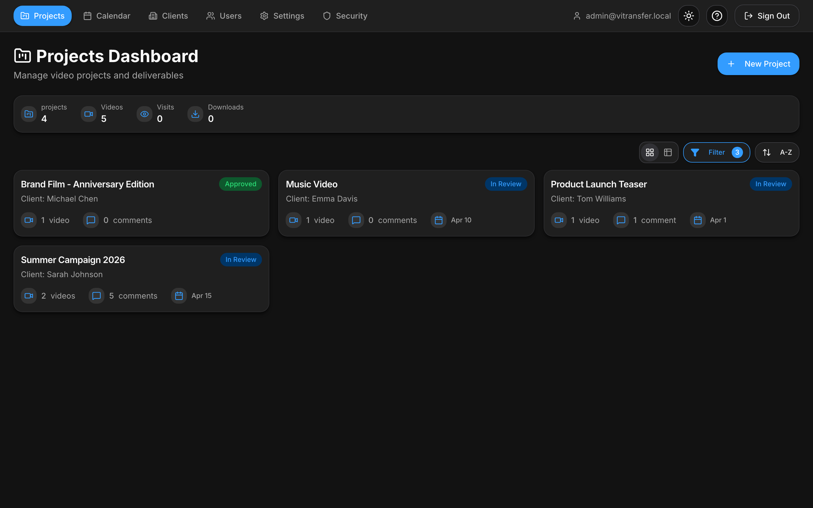

# ViTransfer

**Professional Video Review & Approval Platform for Filmmakers**

ViTransfer is a self-hosted web app for video teams to share work with clients, collect feedback, and manage approvals.

---

> **v1.0** — ViTransfer is production-ready and used in production by many users. Development continues with occasional improvements and fixes as the platform is near feature-complete. Always maintain backups following the 3-2-1 principle (3 copies, 2 different media, 1 offsite) and check release notes before updating. Contributions and feedback are welcome.

> **Docker repo change:** From v1.0.0 onward, the Docker image moved from `crypt010/vitransfer` to `mansivisuals/vitransfer`. If you are upgrading an existing setup, update your Docker Compose, Quadlet, or manual pull commands to use the new repository.

**Support Development:** If you find ViTransfer useful, consider [supporting on Ko-fi](https://ko-fi.com/E1E215DBM4) to help fund continued development.

**NOTE:** Code-assisted development with AI, built with focus on security and best practices.

---

## Quick Start

1. Download [`docker-compose.yml`](docker-compose.yml) and [`.env.example`](.env.example)
2. Create `.env` and generate the required secrets
3. Start with `docker compose up -d`
4. Open `http://localhost:4321` and log in

## Documentation

Full docs live in the [GitHub Wiki](https://github.com/MansiVisuals/ViTransfer/wiki) and are mirrored in [`docs/wiki`](docs/wiki/) (v1.0.0).

| Topic | Link |
|-------|------|
| Home | [docs/wiki/Home.md](docs/wiki/Home.md) |
| Installation | [docs/wiki/Installation.md](docs/wiki/Installation.md) |
| Configuration | [docs/wiki/Configuration.md](docs/wiki/Configuration.md) |
| Features | [docs/wiki/Features.md](docs/wiki/Features.md) |
| Admin Settings | [docs/wiki/Admin-Settings.md](docs/wiki/Admin-Settings.md) |
| Client Guide | [docs/wiki/Client-Guide.md](docs/wiki/Client-Guide.md) |
| Troubleshooting | [docs/wiki/Troubleshooting.md](docs/wiki/Troubleshooting.md) |

## Screenshots

| | |
|---|---|
| **Login** | **Dashboard** |
|  |  |
| **Project View** | **Video Review** |
|  |  |
| **Version Compare** | **Approved Project** |
|  |  |

See all screenshots in the [wiki](docs/wiki/Screenshots.md).

## Contributing

We're community-driven — feedback, issues, and PRs are more than welcome.
See [CONTRIBUTING.md](CONTRIBUTING.md) and [Discussions](https://github.com/MansiVisuals/ViTransfer/discussions).

## Support

- [Issues](https://github.com/MansiVisuals/ViTransfer/issues)
- [Discussions](https://github.com/MansiVisuals/ViTransfer/discussions)
- [Docker Hub](https://hub.docker.com/r/mansivisuals/vitransfer)
- [Support on Ko-fi](https://ko-fi.com/E1E215DBM4)

---

Made for filmmakers and video professionals.
